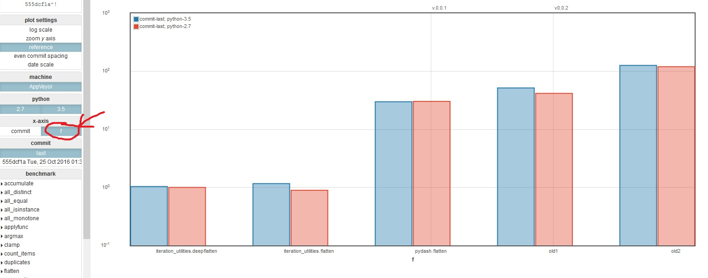
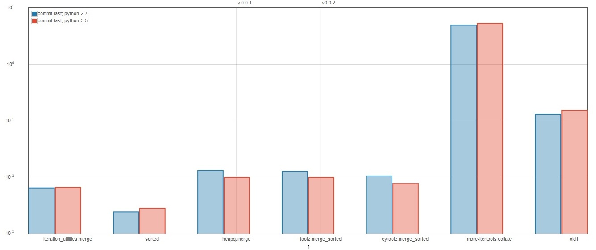

Benchmarks for itertools
========================

There are many packages around implementing the recipes from the [Python
itertools documentation](https://docs.python.org/library/itertools.html#recipes)
in various ways and with varying additional functions. Given the vast number
of packages and implementations this repository is meant to benchmark these.

- View the latest benchmarks [here](https://mseifert04.github.io/iutils_benchmarks/)

Included packages
-----------------

- [iteration_utilities](https://github.com/MSeifert04/iteration_utilities)
- [toolz](https://github.com/pytoolz/toolz)
- [cytoolz](https://github.com/pytoolz/cytoolz)
- [pydash](https://github.com/dgilland/pydash)
- [more-itertools](https://github.com/erikrose/more-itertools)
- and one function from [nx_itertools](https://github.com/nxdevel/nx_itertools)

Additional benchmarks
---------------------

You've got another implementation or package you want to include? Feel free to
submit a pull request to add a benchmark! If you have only one function to
include then please add is inside the code. If you have several functions then
add your package to the matrix and import the functions.

The benchmarking setup is somewhat complicated but just look at the existing
implementations or open an issue and I will help setting it up!

Examples
--------

This package uses [asv](https://github.com/spacetelescope/asv), this means that
it is not exactly intended for comparative benchmarks. But if you look at a
benchmark just select ``[f]`` as ``x-axis`` to compare the function times:

and some examples of a few benchmarks:

